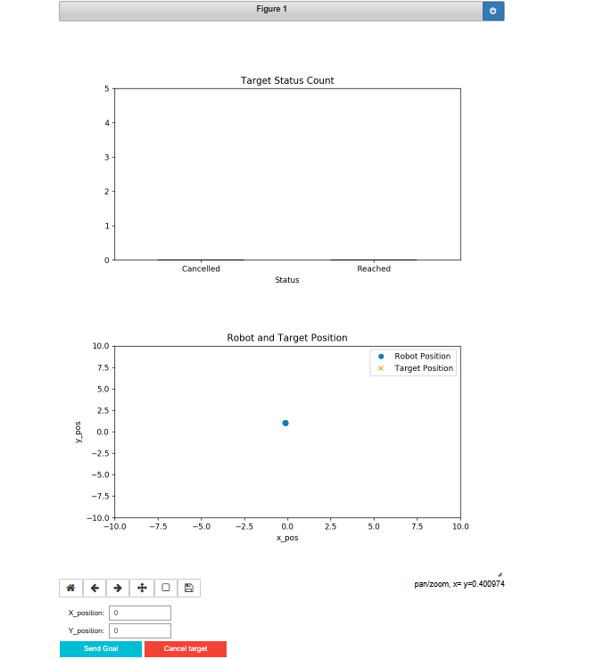

# RT2-Assignments

This repository contains the Research Track 2 Assignments, which consist of 3 individual assignments.

Student: Younes Hebik, ID: 5813030.

## Table of Contents
- [Part 1: Documentation of RT1 Second Assignment](#part-1-documentation-of-rt1-second-assignment)
- [Jupyter Notebook Assignment](#Part-2-Jupyter-Notebook-Assignment)
- [Statistical Analysis](#statistical-analysis)


## Part 1: Documentation of RT1 Second Assignment


This project includes the documentation for the first semester assignment using Doxygen. Doxygen is a powerful documentation generation tool that allows for the creation of structured and well-formatted documentation for codebases. The documentation is written using a markup language and can be transformed into various output formats such as HTML, PDF, and ePub.

## Steps to Create Documentation Using Doxygen

1. **Install Doxygen**
   - Download and install Doxygen from the [official website](http://www.doxygen.nl/).

2. **Prepare Your Code**
   - Comment your code using Doxygen-style comments, such as:
     ```c++
     /**
      * \brief Brief description of the function.
      */
     void exampleFunction(int param1, int &param2);
     ```

3. **Create a Doxyfile**
   - Generate a configuration file using `doxygen -g`.
   - Configure the following settings in the `Doxyfile`:
     - `PROJECT_NAME`
     - `INPUT`
     - `OUTPUT_DIRECTORY`
     - `GENERATE_HTML`
     - `GENERATE_LATEX`

4. **Run Doxygen**
   - Execute `doxywizard` to generate the documentation.
     
##### Link to the documentation: 
##### [RT1 Second Assignment Documentation](https://github.com/younes-hebik/RT2-Assignments/blob/main/assignment_2_2023/html/index.html)

## Part 2: Jupyter Notebook Assignment

Jupyter Notebook is an open-source web application that allows for the creation and sharing of documents containing live code, equations, widgets, animation, visualizations, and explanatory text. The notebook is on the folder **Jupyter**.

In this assignment, I implemented a Jupyter Notebook-based user interface for the second assignment of the RT1 course. The goal was to replace the existing user interface node with an interactive notebook that provides real-time information about the robot's position, targets, and target tracking status. The notebook utilizes widgets for user interaction and incorporates plots to visualize the robot's position, path to target positions, and the number of reached and not-reached targets.

**HOW TO START THE NOTEBOOK**
1. Create a workspace or in any workspace, go to the src folder and clone my repository that contains main  package: the package contains all the necessary nodes Prof's nodes , launchfile, and my node  
2. Launch Gazebo environment and the necessary node  using the commande :
   
 ```python
roslaunch assignment_2_2023 assignment1.launch 
```

3. Download the notebook file **assignment-notebook** and run the notebook using :

```python
jupyter-notebook --allow-root
```

4. From the jupyter **Run All Cells**, the cell before the last will display the folowing interface:   


<p align="center">
  
</p>

5. From this interface  you can set a target  and you can cancel it any time you want,and see its path thanks to the position plot, also you can also see the bar chart for the reached and calnceled targets..


## Part 3: Statistical Analysis

In this part of the assignment, we were asked to perform  a statistical analysis comparing the performance of two code implementations: my code and Boullala's code of the RT1 first assignment. In the Folder **Statistical Analysis** You can find the report of this analysis which explores a full statistical analysis with hyposthesis, expirements and tests leading to conclusion.


